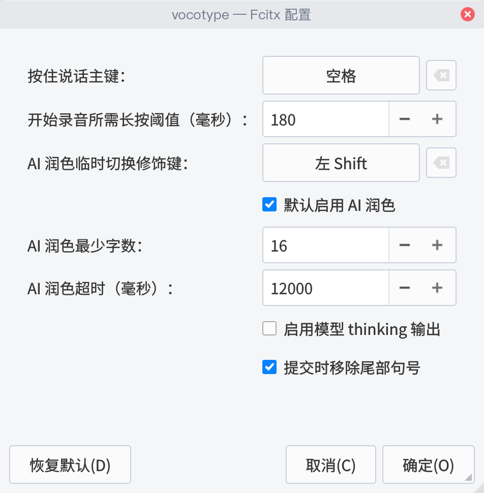

# VoCoType Linux

Linux 离线语音输入法，当前仅维护 **Fcitx 5** 版本。

<video src="screenshots/video.mp4" controls width="720"></video>

这个仓库已经从早期的双前端形态收敛为 **fcitx5-only** 项目：后续只保留 `fcitx5/` 方案，不再继续维护 `ibus` 相关代码、脚本和文档。

## 这个 fork 的主要改动

- 增加了共享用户词典，支持在 `~/.config/vocotype/user-dictionary.yaml` 中维护专有名词、人名和固定写法；词典替换会先于数字归一化执行，最近还补上了别名大小写不敏感处理。
- 数字格式做了更细的上下文判断，独立数字、百分比、时间、日期、房间号等场景会更稳定地转换成合适格式，同时尽量避免误伤固定短语和技术标识。
- 优化了热键与应用兼容性，重点修复了原版在 Qt 程序中的输入问题，并处理了微信文本提交、Ghostty/BlackBox 这类终端场景，减少空格丢失、提交异常和注入不稳定的问题。
- 修正了 Fcitx 5 下的 Rime 集成方式，普通打字继续走 Rime，语音输入直接提交，不需要在语音输入和拼音输入之间来回切换输入法。
- 安装体验也补齐了一些细节，比如首次安装后自动重启后台服务，以及自动准备用户词典模板，减少“装好了但还不能直接用”的情况。

## 核心特性

- 本地离线语音识别，不上传音频
- `F9` 按住说话，松开提交
- AI 润色可在输入法配置面板中默认开启，并按字数阈值触发
- `Shift+F9` 临时反向切换本次录音是否 AI 润色
- 与 Fcitx 5 Rime 配合使用，语音和拼音共存
- 共享用户词典：`~/.config/vocotype/user-dictionary.yaml`

## 快速开始

```bash
git clone https://github.com/LeonardNJU/VocoType-linux.git
cd VocoType-linux
bash fcitx5/scripts/install-fcitx5.sh
systemctl --user enable --now vocotype-fcitx5-backend.service
fcitx5 -r
```

安装脚本会完成：

1. 检查 Fcitx 5 编译依赖
2. 构建并安装 `fcitx5` addon
3. 安装 Python 后端
4. 配置音频设备
5. 可选写入 Rime 和 SLM 配置

安装完成后，在 `fcitx5-configtool` 中添加 `VoCoType` 输入法。

输入法配置面板可以直接调整 AI 润色默认开关、触发字数、超时和 thinking 开关：



## 目录结构

```text
VoCoType Linux
├── app/                    # 共享语音识别与文本处理逻辑
├── fcitx5/
│   ├── addon/              # Fcitx 5 C++ addon
│   ├── backend/            # Python backend
│   ├── data/               # addon/inputmethod 配置
│   └── scripts/
├── docs/
└── scripts/                # 调试与辅助脚本
```

## 常用文件

- 主安装说明：[fcitx5/README.md](fcitx5/README.md)
- 常见问题：[docs/FAQ.md](docs/FAQ.md)
- Rime 配置：[RIME_CONFIG_GUIDE.md](RIME_CONFIG_GUIDE.md)
- 变更记录：[CHANGELOG.md](CHANGELOG.md)

## 使用说明

- `F9`：极速模式，仅 ASR + 标点
- `Shift+F9`：临时反向切换本次录音是否 AI 润色
- 普通键盘输入：走 Fcitx 5 / Rime

当前仓库不再提供 IBus 版的 `Ctrl+F9` 语音编辑链路。

## 环境要求

- Linux
- Python 3.11 或 3.12
- Fcitx 5
- CMake / pkg-config / C++ 编译器
- `libfcitx5-dev` 或等价开发包

## 独立维护说明

本仓库当前按独立项目维护，文档、安装流程和发布口径以本仓库为准，不再以早期上游的双前端结构为目标。

## 上游与致谢

本仓库最初 fork 自上游仓库：

- [LeonardNJU/VocoType-linux](https://github.com/LeonardNJU/VocoType-linux)

同时，项目核心能力延续并受益于：

- [233stone/vocotype-cli](https://github.com/233stone/vocotype-cli)

感谢上游作者和相关贡献者完成前期设计、实现与开源发布。当前仓库在此基础上继续独立维护，并将后续维护重点收敛到 Fcitx 5 版本。

## 许可证

本仓库继续遵守上游项目的开源协议，并保留相应的许可证与声明文件。

- 当前仓库随附许可证文件：[LICENSE](LICENSE)
- 第三方依赖与模型许可说明：[THIRD_PARTY_NOTICES.md](THIRD_PARTY_NOTICES.md)

如果你分发、修改或继续 fork 本仓库，请一并遵守上游许可证要求，并保留相关版权与许可声明。

## 致谢

- [LeonardNJU/VocoType-linux](https://github.com/LeonardNJU/VocoType-linux)
- [VoCoType](https://github.com/233stone/vocotype-cli)
- [FunASR](https://github.com/modelscope/FunASR)
- [Rime](https://rime.im/)

第三方许可见 [THIRD_PARTY_NOTICES.md](THIRD_PARTY_NOTICES.md)。
